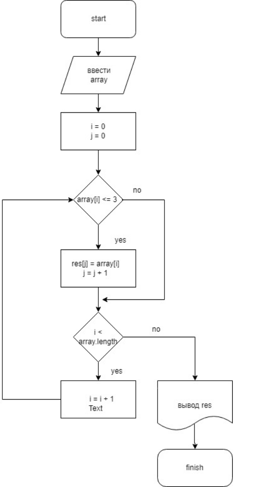

**Итоговая контрольная работа по основному блоку**
*язык программирования С#*

Алгоритм такой:

1. Создать репозиторий на GitHub:

_Вот он:_ [ссылка на мой репозиторый GitHub](https://github.com/Firstivan/Kontrolnaya)

2. Нарисовать блок-схему алгоритма (можно обойтись блок-схемой основной содержательной части, если вы выделяете её в отдельный метод):

_Вот моя блок схема:_ 

3. Снабдить репозиторий оформленным текстовым описанием решения (файл README.md):

_Вы его сейчас и читаете)))_

4. Написать программу, решающую поставленную задачу:

_**Программа внесена в репозиторий и имеет имя Program.cs**_

5. Использовать контроль версий в работе над этим небольшим проектом (не должно быть так, что всё залито одним коммитом, как минимум этапы 2, 3, и 4 должны быть расположены в разных коммитах):

_**Коммиты делаю в одной ветке, так как параллельно никто не работает и не проверяет файл**_

Задача: Написать программу, которая из имеющегося массива строк формирует новый массив из строк, длина которых меньше, либо равна 3 символам. Первоначальный массив можно ввести с клавиатуры, либо задать на старте выполнения алгоритма. При решении не рекомендуется пользоваться коллекциями, лучше обойтись исключительно массивами.
